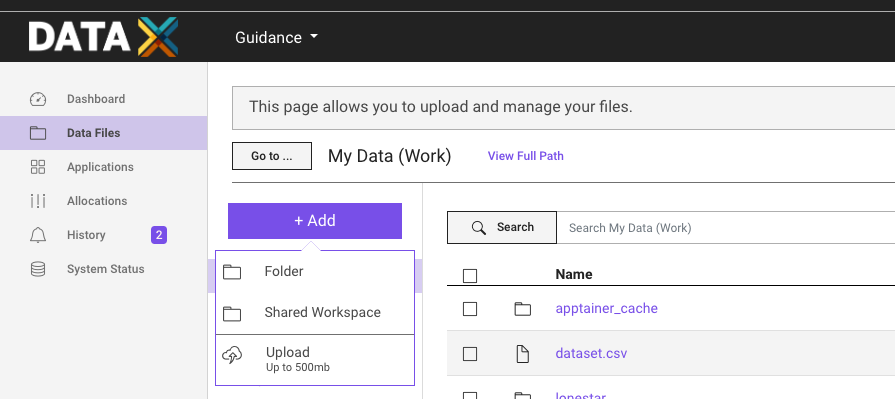
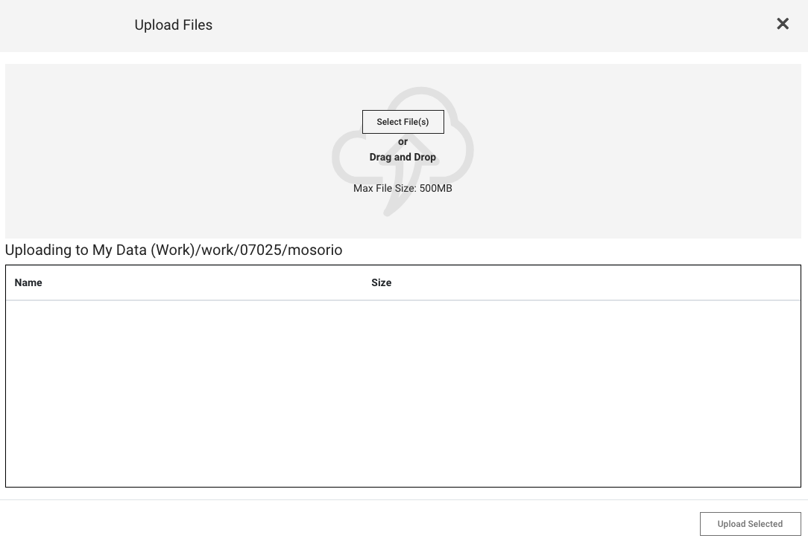
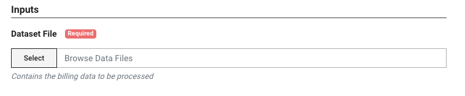
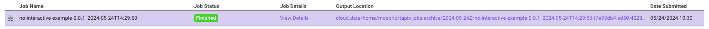
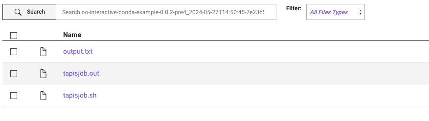
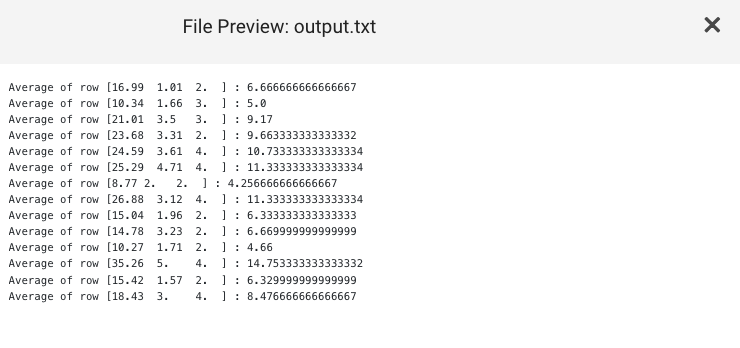

This tutorial is the first in a [series of tutorials](#next-tutorials) that will guide you through the process of creating a cookbook and running it on TACC systems. From simple ones that run a command to more complex ones that run a Python using conda or a Jupyter Notebook.

## Requirements

- A GitHub account
- TACC account. If you don't have one, you can request one [here](https://accounts.tacc.utexas.edu/register)
- To access TACC systems, you should have an [allocation](https://tacc.utexas.edu/use-tacc/allocations/)
  - You can see your allocations [here](https://ptdatax.tacc.utexas.edu/workbench/allocations/approved)
  - If you don't have an allocation, you can request one [here](https://portal.tacc.utexas.edu/allocation-request)

## Tutorial

In this tutorial, we will create a simple Python script that will be used to demonstrate how to run a cookbook a TACC cluster and obtain the output using a UI. This cookbook will run a Python script that reads a CSV file, calculates the average of the values in the first column, and writes the result to a file.

The file will be storaged on the TACC storage system. In this case, the file is small however, you can use the same process to analyze large files.

### How does it work?

### 1. Upload the file to the TACC storage system

One of our goal is to demostrate how to use the TACC storage system to store the input and output files. In this case, we will upload a CSV file to the TACC storage system.

1. Go to the [TACC Portal](https://portal.tacc.utexas.edu)
2. Click on the "Data Files" tab
3. Click on the "Add +" button
   
4. Click on the "Upload" button
   
5. Select the file you want to upload

### 2. Define dependencies using `environment.yaml`

The `environment.yaml` file is used to define the dependencies required to run the cookbook. In this case, we need Python and Pandas.

### 3. Create the Python script

The Python script reads the CSV file, calculates the average of the values in the first column, and writes the result to a file. The script is named `main.py`.

### 4. Create the `run.sh` file

The `run.sh` file is used to run the Python script. It activates the conda environment and runs the Python script.

```bash
#!/bin/bash
set -xe

cd ${_tapisExecSystemInputDir}
python /code/main.py billing.csv ${_tapisExecSystemOutputDir}/output.txt
```

The `run.sh` has two variables that are used to define the input and output directories. These variables are `_tapisExecSystemInputDir` and `_tapisExecSystemOutputDir`.

### 5. Update the Cookbook Definition `app.json` File

Each app has a unique `id` and `description`. So, you should change these fields to match your app's name and description.

1. Download the `app.json` file
2. Change the values `id` and `description` fields with the name and description as you wish.

### 6. Create a New Application on the Cookbook UI

1. Go to [Cookbook UI](https://in-for-disaster-analytics.github.io/cookbooks-ui/#/apps)
2. Click on the "Create Application" button
3. Fill in the form with the information from your `app.json` file
4. Click "Create Application"
5. A new application will be created, and you will be redirected to the application's page

### 7. Run Your Cookbook

1. Click on the "Run" button on the right side of the page. This will open the Portal UI
2. Click on the "Select" button to choose the input file
   
3. Click "Run"

### 8. Check the Output

1. After the job finishes, you can check the output by clicking on the "Output location" link on the job's page
   
2. You will be redirected to the output location, where you can see the output files generated by the job
   
3. Click on a file to see its content. In this case, the file is named `output.txt`
   

## Next Tutorials

- [Running a Python script]
- [Running a Jupyter Notebook]

## Authors

William Mobley - wmobley@tacc.utexas.edu
Maximiliano Osorio
